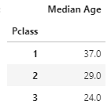
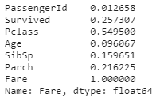
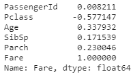
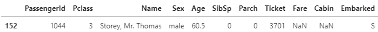
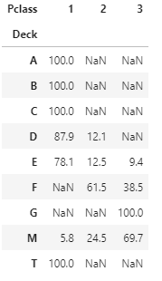
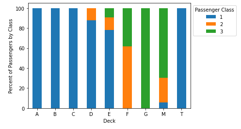

# Titanic Challenge Using Pandas and Supervised Machine Learning

## Overview of the Titanic Challenge

### Purpose

The purpose of this challenge is to create a machine learning model that will predict whether or not a passenger of the Titanic survived based on various factors. This challenge is from [Kaggle](https://www.kaggle.com/c/titanic).

## Data Dictionary

Kaggle provided a training dataset and a test dataset. The training dataset included the 'Survived' variable and was used to train the machine learning model. The test dataset does not include the 'Survived' variable and was used to test whether or not the model was able to accurately predict whether or not the passenger survived. The predictions are submitted to Kaggle and an accuracy score is given.

The training dataset includes 891 observations and the test dataset includes 418 observations.


## Missing Values

In order to better understand the dataset and clean it as necessary, I first looked to see if the data had any missing values.

Train Dataframe


Test Dataframe


Only a few variables are missing values: Age (263), Fare (1), Cabin (1,014), and Embarked (2).

### Age Missing Values

Because age is a continuous variable, it would be beneficial to impute the missing age values with either the mean or the median. To see which would be best to use, I first looked to see if age followed a normal or skewed distribution.


Seeing as there is a slight skew, I believe it would be best to impute the missing age values with the median. Before simply imputing all the missing age values with one median, it is worth checking first whether age is correlated with any other variables.

Train Dataframe Age Correlation


Test Dataframe Age Correlation


As we can see, age is most correlated with passenger class. Therefore, I grouped age by passenger class and found the median for each. I then imputed these values for the missing age values.



```
# Impute median ages in the training dataframe
train_frames = []
for i in list(set(train_df['Pclass'])):
    train_df_pclass = train_df[train_df['Pclass'] == i]
    train_df_pclass['Age'].fillna(train_df_pclass['Age'].median(),inplace=True)
    train_frames.append(train_df_pclass)
    new_train_df = pd.concat(train_frames)

# Impute median ages in the testing dataframe
test_frames = []
for i in list(set(test_df['Pclass'])):
    test_df_pclass = test_df[test_df['Pclass'] == i]
    test_df_pclass['Age'].fillna(train_df_pclass['Age'].median(),inplace=True)
    test_frames.append(test_df_pclass)
    new_test_df = pd.concat(test_frames)
```

### Fare Missing Values

For the missing Fare value, it might be safe to assume that the mean would be the best option to impute according to the passenger class. We can first check that the fare and passenger class are highly correlated.

Train Dataframe Fare Correlation



Test Dataframe Fare Correlation



Seeing as fare is indeed highly correlated with passenger class, I found the null Fare value and saw that the passenger was third class.



Using the train data, I found the mean of third class fare, which was 13.6756, and imputed the mean for the missing Fare value.

```
per_pclass_fare = new_train_df.groupby(['Pclass']).mean()['Fare']
per_pclass_fare_df = pd.DataFrame({"Average Fare": per_pclass_fare})
per_pclass_fare_df

new_test_df['Fare'] = new_test_df['Fare'].fillna(13.6756)
```

### Cabin Missing Values

The missing cabin values are substantial - about 77% of Cabin values are missing from the training dataset and about 78% of Cabin values are missing from the testing dataset. With so much of the data missing, it is worth considering dropping the Cabin factor altogether. However, it is reasonable to assume that the location of the passengers' cabin would be an important factor in who survived when taking into to account where the boat split apart, how far a passenger was from stairs or an emergency exit, how much closer they were to the deck to access lifeboats, etc. Therefore, I decided to keep the cabin variable. In order to account for the missing values, I simply replaced the NaNs with "Missing."

```
new_train_df['Cabin'] = new_train_df['Cabin'].fillna('Missing')
new_test_df['Cabin'] = new_test_df['Cabin'].fillna('Missing')
```

### Embarked Missing Values

For the two missing embarked values, I researched the names of the passengers who were missing. I was able to find the two passengers, Mrs. George Nelson Stone (Martha Evelyn Stone Harrington) and Miss. Amelie Icard on [Encyclopedia Titanica](https://www.encyclopedia-titanica.org/titanic-survivor/martha-evelyn-stone.html). Both embarked out of Southampton. I therefore imputed their missing embarked values with S.

```
new_train_df['Embarked'] = new_train_df['Embarked'].fillna('S')
```

## Binning the Data

In order for the machine learning model to run more efficiently and increase accuracy, a good strategy is to bin variables with large amounts of unique values. For this Titanic dataset, the Age and Cabin variables are viable candidates for binning. From the Cabin data, I extracted and created a new column with the deck letters alone and binned the data by deck.

### Binning Age

For the Age variable, I binned the data based on categories the U.S. Census uses for age ranges. I therefore binned the age data as such: 0-17 years, 18-24 years, 25-44 years, 45-64 years, and 65+ years.

```
age_bins = [0, 17, 24, 44, 64, np.inf]
age_names = ['0-17 years', '18-24 years', '25-44 years', '45-64 years', '65+ years']
new_train_df['Age'] = pd.cut(new_train_df['Age'], age_bins, labels=age_names)
new_test_df['Age'] = pd.cut(new_test_df['Age'], age_bins, labels=age_names)
```

### Binning Deck
Binning the cabin data was less straightforward as the data includes the deck, which is characterized by a letter, and the cabin number together. The most important information in the value is the deck letter as the decks can be binned together based on the similarity of passenger class demographics. The Cabin feature would then be dropped in order to reduce noise in the data. Before I could bin the decks however, I first needed to best visualize the distribution of the three passenger classes amongst each deck, which I decided would be a stacked bar chart.

I first created a new Deck column in the training and testing dataframes by slicing the Cabin column values.

```
new_train_df = new_train_df.assign(Deck = new_train_df['Cabin'].str[:1])
new_test_df = new_test_df.assign(Deck = new_test_df['Cabin'].str[:1])
```

I then created a new dataframe called 'deck_df' which was grouped by the deck and passenger class and counted the values for each.

```
deck_df = new_train_df.groupby(['Deck', 'Pclass']).count().drop(columns=['Survived', 'Sex', 'Age', 'SibSp', 'Parch', 'Fare', 'Embarked', 'Cabin', 'PassengerId', 'Ticket']).rename(columns={'Name':'Count'}).reset_index()
```

I pivoted the dataframe in order to put it in the format needed for a stacked bar chart.

```
deck_df = deck_df.pivot(index='Deck', columns='Pclass', values='Count')
```

To make the stacked bar chart easier to read and understand, I converted the absolute values to percentages.

```
deck_df = deck_df.div(deck_df.sum(axis=1), axis=0).multiply(100).round(1)
```

The final deck dataframe looked as such:



With the deck dataframe finalized, I was able to create the stacked bar chart needed to visualize the distributions using matplotlib:

```
deck_df.plot.bar(stacked=True)
plt.legend(title='Passenger Class', loc='upper left', bbox_to_anchor=(1,1))
plt.xlabel('Deck')
plt.ylabel('Percent of Passengers by Class')
plt.xticks(rotation=0)
```



Based on the stacked bar chart, it would seem to make the most sense to bin the Deck data as such:

- ABC: 100% of decks A, B, and C are all first class passengers. The one passenger on T Deck is also included in the ABC bin as they are first class.
- DE: Share a very similar distribution of passenger classes with the only difference being Deck E introducing a small percentage of third class passengers.
- FG: Deck F has an almost even distribution of second and third class passengers and Deck G has 100% third class passengers. While the distributions are not very similar, the proximity of the decks to each other and both containing third class passengers gives enough reason to bin the decks together.
- M: Missing data

To further confirm that the binning of the decks are 

## Machine Learning

With the missing values now accounted for, the data is ready to be processed through a machine learning model. To find the model with the most accuracy, I tested three different models: a logistic regression model, a random forest model, and a support vector machine (SVM). A logistic regression model is a straightfoward choice - it predicts binary outcomes by analyzing the available data and mathematically determines the probability of new samples belonging to a class. A random forest model is also a potentially good model as it uses many small decision trees to create strong predictive power. Random forest models are also robust against overfitting the data. An SVM, similar to the logistic regression, is a binary classifier. However, SVMs separate the two classes in a dataset with the widest possible margin, which can make exceptions for outliers, making it a contender to be a good machine learning model.

### Logistic Regression Model

```
# Import machine learning dependencies
from sklearn.linear_model import LogisticRegression

# Create target variable and features
y = new_train_df['Survived']

features = ['Pclass', 'Sex', 'Age', 'SibSp', 'Parch', 'Fare', 'Embarked']
X = pd.get_dummies(new_train_df[features])
X_test = pd.get_dummies(new_test_df[features])

# Use StandardScaler to scale the data
from sklearn.preprocessing import StandardScaler

scaler = StandardScaler()

X_scaler = scaler.fit(X)

X_train_scaled = X_scaler.transform(X)
X_test_scaled = X_scaler.transform(X_test)

# Create logistic regression model
model = LogisticRegression(solver='liblinear', max_iter=200, random_state=1)

# Train the model with training data
model.fit(X_train_scaled, y)

# Have the model run predictions on the test data
predictions = model.predict(X_test_scaled)

# Output
output = pd.DataFrame({'PassengerId': new_test_df.PassengerId, 'Survived': predictions})
output

# Export to csv
output.to_csv('log_reg_submission.csv', index=False)
```

