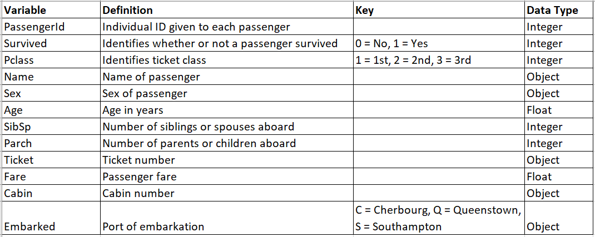
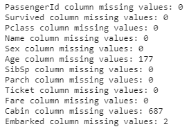
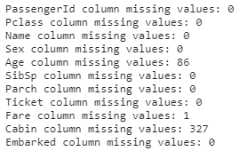
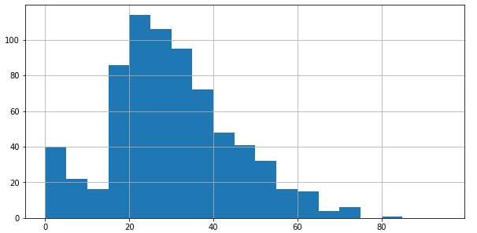
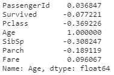
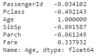

# Titanic Challenge Using Pandas and Supervised Machine Learning

## Overview of the Titanic Challenge

### Purpose

The purpose of this challenge is to create a machine learning model that will predict whether or not a passenger of the Titanic survived based on various factors. This challenge is from [Kaggle](https://www.kaggle.com/c/titanic).

## Data Dictionary

Kaggle provided a training dataset and a test dataset. The training dataset included the 'Survived' variable and was used to train the machine learning model. The test dataset does not include the 'Survived' variable and was used to test whether or not the model was able to accurately predict whether or not the passenger survived. The predictions are submitted to Kaggle and an accuracy score is given.

The training dataset includes 891 observations and the test dataset includes 418 observations.

## Missing Values

In order to better understand the dataset and clean it as necessary, I first looked to see if the data had any missing values.

Train Dataframe

Test Dataframe

Only a few variables are missing values: Age (263), Fare (1), Cabin (1,014), and Embarked (2).

### Age Missing Values
Because age is a continuous variable, it would be beneficial to impute the missing age values with either the mean or the median. To see which would be best to use, I first looked to see if age followed a normal or skewed distribution.

Seeing as there is a slight skew, I believe it would be best to impute the missing age values with the median. Before simply imputing all the missing age values with one median, it is worth checking first whether age is correlated with any other variables.

Train Dataframe Age Correlation

Test Dataframe Age Correlation

As we can see, age is most correlated with passenger class. Therefore, I grouped age by passenger class and found the mean for each. I then imputed these values for the missing age values.
